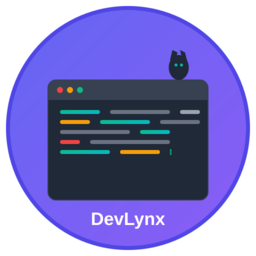

# DevLynx - AI-Powered Development Assistant 🚀

<div align="center">



**A modern, AI-powered desktop assistant for developers on Linux**

[](https://flutter.dev)
[](https://dart.dev)
[](https://www.linux.org)
[](https://opensource.org/licenses/MIT)

</div>

## ✨ Features

### 🎯 Smart Project Management
- **Intelligent Project Detection**: Automatically scans and detects 12+ project types
- **Modern Card-Based UI**: Responsive, glassmorphism-inspired project cards
- **Quick Actions**: Context-aware actions for each project type
- **Project Notes**: Built-in note-taking with tags and search
- **Real-time Analytics**: Track project usage and development patterns

### 🤖 AI-Powered Assistance
- **Multi-AI Provider Support**: OpenAI, Anthropic Claude, Google Gemini, Groq, and local Ollama
- **Intelligent Insights**: AI-generated project recommendations and insights
- **Smart Suggestions**: Context-aware development tips and optimizations
- **Daily Briefings**: Personalized productivity recommendations
- **Code Analysis**: AI-powered project analysis and suggestions

### 📊 Advanced Analytics
- **Developer Productivity Metrics**: Track coding sessions, project launches, and tool usage
- **Visual Dashboards**: Beautiful charts and statistics
- **Time Tracking**: Automatic session tracking and productivity analysis
- **Trend Analysis**: Weekly and monthly development patterns
- **Performance Insights**: Identify productivity bottlenecks

### 🛠️ Comprehensive Tool Detection
- **50+ Development Tools**: Automatic detection of languages, frameworks, and tools
- **Categorized View**: Organized by Languages, Frameworks, Databases, DevOps, etc.
- **Version Information**: Display tool versions and availability
- **Integration Status**: Check tool configuration and health

### 🎨 Modern UI/UX (2025 Design Trends)
- **Material Design 3**: Latest Material You design system
- **Responsive Layout**: Optimized for various screen sizes
- **Glassmorphism Effects**: Modern translucent design elements
- **Smooth Animations**: Fluid transitions and micro-interactions
- **Dark/Light Themes**: Automatic theme switching support
- **Accessibility**: WCAG compliant design patterns

### 🔧 System Integration
- **Auto-start Service**: Systemd integration for background operation
- **Desktop Integration**: Native Linux desktop entry
- **Command Line Interface**: Direct terminal access
- **Voice Commands**: Basic voice interaction support
- **Notification System**: Desktop notifications for important events

## 🚀 Supported Project Types

| Type | Languages/Frameworks | Quick Actions |
|------|---------------------|---------------|
| **Flutter** | Dart, Flutter SDK | Run, Build, Test, Clean, Pub Get |
| **React** | JavaScript, TypeScript, JSX | Start, Build, Test, Install, Lint |
| **Vue.js** | JavaScript, TypeScript, Vue | Serve, Build, Test, Install, Lint |
| **Angular** | TypeScript, Angular CLI | Serve, Build, Test, Install, Lint |
| **Node.js** | JavaScript, TypeScript, npm | Start, Test, Install, Build, Lint |
| **Next.js** | React, TypeScript, Next.js | Dev, Build, Start, Test, Install |
| **Python** | Python, pip, venv | Run, Test, Install, Lint, Format |
| **Rust** | Rust, Cargo | Run, Build, Test, Check, Clippy |
| **Go** | Go modules | Run, Build, Test, Mod Tidy, Vet |
| **Java** | Maven, Gradle | Compile, Test, Run, Package, Clean |
| **C++** | CMake, Make | Build, Run, Test, Clean, Debug |
| **Docker** | Dockerfile, Compose | Build, Run, Up, Down, Logs |

## 🤖 AI Providers

DevLynx supports multiple AI providers for maximum flexibility:

### Cloud Providers
- **OpenAI**: GPT-4, GPT-4-turbo, GPT-3.5-turbo
- **Anthropic**: Claude-3 (Haiku, Sonnet, Opus)
- **Google Gemini**: Gemini Pro, Gemini Pro Vision
- **Groq**: Ultra-fast Llama, Mixtral, Gemma models

### Local AI
- **Ollama**: Privacy-focused local AI models
  - Supports Llama 3.2, Code Llama, Mistral, and more
  - No internet required, complete privacy
  - Easy model management

## 📦 Installation

### Quick Install (Recommended)
```bash
# Clone the repository
git clone https://github.com/yourusername/devlynx.git
cd devlynx

# Run the installation script
chmod +x install_devlynx.sh
./install_devlynx.sh
```

### Manual Installation

1. **Prerequisites**
   ```bash
   # Install Flutter
   sudo snap install flutter --classic
   
   # Install dependencies
   sudo apt update
   sudo apt install git curl unzip
   ```

2. **Build the Application**
   ```bash
   # Get dependencies
   flutter pub get
   
   # Build for Linux
   flutter build linux --release
   ```

3. **System Integration**
   ```bash
   # Copy executable
   sudo cp build/linux/x64/release/bundle/devlynx /usr/local/bin/
   
   # Create desktop entry
   cp devlynx.desktop ~/.local/share/applications/
   
   # Install systemd service
   cp devlynx.service ~/.config/systemd/user/
   systemctl --user enable devlynx.service
   systemctl --user start devlynx.service
   ```

## ⚙️ Configuration

### AI Configuration
1. Open DevLynx
2. Click the AI configuration button (🤖) in the top toolbar
3. Select your preferred AI provider
4. Enter your API key and model preferences
5. Test the connection

### Project Scanning
DevLynx automatically scans these directories:
- `~/Projects`
- `~/Desktop/Projects`
- Custom directories (configurable)

### Voice Commands (Optional)
```bash
# Install speech recognition dependencies
sudo apt install espeak espeak-data libespeak1 libespeak-dev
```

## 🎯 Usage

### Basic Operations
- **Launch Projects**: Click on project cards to launch in preferred IDE
- **Quick Actions**: Use the action menu for common development tasks
- **Search & Filter**: Find projects by name, type, or technology
- **Notes**: Add and manage project-specific notes with tags

### AI Features
- **Smart Insights**: Get AI-powered project analysis and suggestions
- **Daily Recommendations**: Receive personalized productivity tips
- **Code Assistance**: Ask AI about project optimization and best practices
- **Trend Analysis**: Understand your development patterns

### Analytics Dashboard
- **Session Tracking**: Monitor coding sessions and productivity
- **Project Statistics**: View launch frequency and usage patterns
- **Tool Usage**: Track which development tools you use most
- **Productivity Metrics**: Analyze your development efficiency

## 🔧 Development

### Project Structure
```
devlynx/
├── lib/
│   ├── data/           # Data models and managers
│   ├── services/       # Core services (AI, Voice, Launcher)
│   ├── ui/            # User interface components
│   │   ├── screens/   # Main application screens
│   │   └── widgets/   # Reusable UI components
│   └── utils/         # Utility functions
├── assets/            # Images, icons, and resources
├── linux/             # Linux-specific configuration
└── scripts/           # Build and deployment scripts
```

### Key Components
- **AI Service**: Multi-provider AI integration with fallback support
- **Analytics Manager**: Comprehensive usage tracking and insights
- **Project Scanner**: Intelligent project detection and metadata extraction
- **Modern UI Components**: Responsive, accessible interface components
- **Voice Service**: Speech recognition and text-to-speech capabilities

### Building from Source
```bash
# Development build
flutter run -d linux

# Release build
flutter build linux --release

# Run tests
flutter test

# Analyze code
flutter analyze
```

## 🤝 Contributing

We welcome contributions! Please see our [Contributing Guidelines](CONTRIBUTING.md) for details.

### Development Setup
1. Fork the repository
2. Create a feature branch
3. Make your changes
4. Add tests if applicable
5. Run `flutter analyze` and `flutter test`
6. Submit a pull request

## 📋 Roadmap

### Version 2.0 (Current)
- ✅ Multi-AI provider support
- ✅ Modern UI overhaul
- ✅ Advanced analytics
- ✅ Production-ready features

### Version 2.1 (Planned)
- 🔄 Plugin system for custom integrations
- 🔄 Cloud sync for settings and notes
- 🔄 Advanced voice commands
- 🔄 Mobile companion app

### Version 3.0 (Future)
- 🔄 AI-powered code generation
- 🔄 Team collaboration features
- 🔄 Advanced project templates
- 🔄 Integration with popular IDEs

## 🐛 Known Issues

- Voice recognition requires additional Linux packages
- Some AI providers may have rate limits
- Large project scans may take time on first run

## 📄 License

This project is licensed under the MIT License - see the [LICENSE](LICENSE) file for details.

## 🙏 Acknowledgments

- Flutter team for the amazing framework
- Material Design team for design guidelines
- All AI providers for making intelligent assistance possible
- Open source community for inspiration and tools

## 📞 Support

- **Issues**: [GitHub Issues](https://github.com/yourusername/devlynx/issues)
- **Discussions**: [GitHub Discussions](https://github.com/yourusername/devlynx/discussions)
- **Email**: support@devlynx.dev

---

<div align="center">

**Made with ❤️ for developers, by developers**

[⭐ Star this project](https://github.com/yourusername/devlynx) if you find it useful!

</div>
